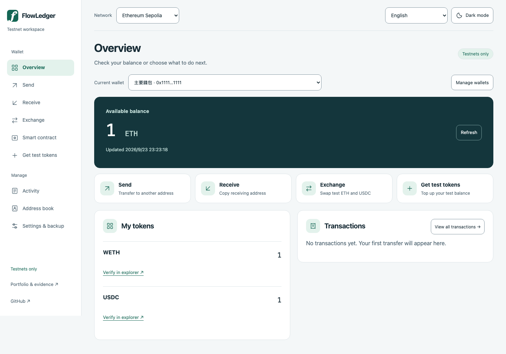

# Testnet Wallet Lab

[English](README.md) · [简体中文](README.zh-CN.md) · [正體中文（台灣）](README.zh-TW.md) · [繁體中文（香港）](README.zh-HK.md)

**[在线 Demo（仅供测试链使用）](https://wallet.tedlin.fyi/)**

用 Go 编写的多链测试网钱包实验项目，用来实现转账、代币兑换、交易跟踪，以及 RPC 失败或进程重启后的恢复处理。

*界面预览使用本地测试数据。*

## Solidity 测试 ETH 存款箱

Solidity 存款／提款合约搭配 Sepolia 面板，包含每个地址独立余额与重入保护。[2026-09-19 验收记录](docs/evidence/vault-sepolia-2026-09-19/REPORT.md)记录了公共 Sepolia 部署、Sourcify 源码验证及存取结果；Etherscan 单独验证仍未完成。记录对应当时版本，未配置合约地址的环境仍禁用操作。

新增[测试 USDC 付款托管](docs/payment-escrow.md)：付款人付款与放款，收款人可全额退回原付款人。沿用交易日志与重试流程，提供合约、Go/HTTP 及 Chromium＋模拟 EVM 测试；已在公共 Sepolia 完成付款、放款与退款，见[交易收据与余额验收](docs/evidence/escrow-sepolia-2026-09-22/README.md)。

[合约、测试与启用方式](docs/eth-vault.md)。存款箱使用 AI 协作开发。

## 本地启动与验证

[本地启动](docs/wallet-reference.md#run-with-docker) · [架构](docs/architecture.md) · [交易恢复验证](docs/demo-script.md) · [Go 风格与检查](docs/go-style.md) · [验收证据](docs/evidence/README.md)

## 主要功能

- 创建、恢复及管理本地钱包，支持加密备份。
- 发送原生币与代币、预览手续费，设置或撤销 ERC-20 授权额度。
- 在 Ethereum Sepolia 包装／解包 WETH，通过 Uniswap V3 兑换 WETH 与测试 USDC。
- 根据交易收据整理 EVM 收支记录，支持 CSV 导出。

## 交易处理

交易签名后先保存，再发送到 RPC。同一账户、网络与 quote ID 的重试会复用已保存的交易。广播结果不明时，会按各链的有效期规则重发原始签名数据。

EVM 收据是否成功、所在区块是否仍在主链，以及是否 finalized，分别核对。进程重启后，钱包会读取交易日志，继续跟踪已保存的交易。

## 支持网络

| 网络 | 功能 |
|---|---|
| Ethereum Sepolia | 原生币／ERC-20 转账与授权、WETH 包装、Uniswap V3 兑换 |
| Arbitrum、Base、OP Sepolia · Polygon Amoy | 原生币／ERC-20 转账与授权 |
| Solana Devnet | SOL 转账，使用独立钱包 |
| TRON Shasta | TRX／TRC-20 转账，使用独立钱包 |

## 智能合约钱包实验

已在 Ethereum Sepolia 完成账户部署与转账测试，目前仅支持命令行操作。

## 公开 Demo 部署

[部署与验证说明](docs/deployment.md)包含 VM、免费 Cloudflare Tunnel、共享测试钱包模式与 main 自动部署设置。共享模式下，访客免网站登录使用同一个测试钱包；签署新交易及导出加密密钥仍需钱包密码，访客可创建并命名受密码保护的 EVM 测试钱包（全站最多 20 个）；已有钱包的更名、归档仍受限制。VM 主动拉取验证后镜像，不需要 CI SSH 凭证。公开网址：https://wallet.tedlin.fyi/ 。每次 push main 通过 CI 后发布镜像，VM 每两分钟检查更新。

界面将交易状态与依收据整理的收支明细集中在“活动”。诊断入口放在设置；公开共享模式隐藏无法使用的管理操作。EVM、Solana 与 TRON 的地址簿支持搜索、改名、复制、直接发送及移除后恢复，依测试网络存储在当前浏览器；不会跨设备同步。EVM 收款人菜单也包含已创建的钱包。测试币由按钮直接申请；EVM／TRON 需配置有库存的专用发币账户，SOL 使用 Devnet 空投并受上游额度限制。Demo 部署以 TEST_FAUCET_CONFIG 指向 /data/wallet 内权限为 0600 的 JSON 配置文件；发币私钥与密码不可提交至 Git。
