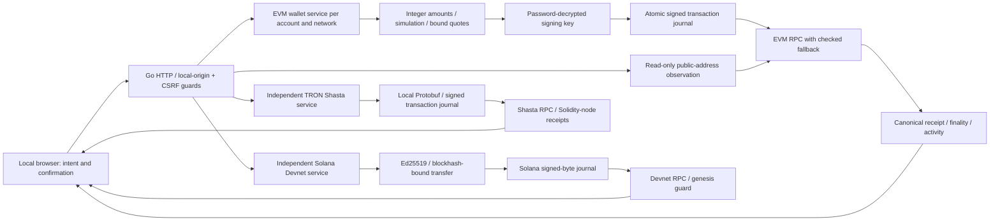

# FlowLedger architecture and interview guide

## What an interviewer can verify

| Question | Evidence to inspect |
|---|---|
| What happens if broadcast succeeds but the HTTP response is lost? | journal-before-broadcast, quote ID lookup, exact raw-byte retry, browser response-loss test |
| How can several replacement hashes refer to one payment? | shared EVM nonce, preservation of payload, group receipt winner and reorg behavior |
| How do you avoid floating point errors? | Go big.Int / integer lamports, decimal parsing, raw units in CSV and confirmations |
| How are forks handled? | receipt block-hash canonical comparison, fresh versioned state update, finalized RPC tag |
| Is adding an L2 just changing an RPC URL? | OP L1/operator fee reserve, receipt fee accounting, separate chain IDs and journals |
| What differs on Solana? | Ed25519, native message format, recent blockhash + last-valid height, signatures and finalized commitment |
| How much does the scanner cover? | saved start/cursor, errors preserve cursor, bounded scans, no complete-history claim |

The local browser is a trusted UI, but input remains untrusted: chain, contract, recipient, amount and operation are validated server-side. RPC endpoints are a trust boundary; fallback provides transport recovery, not independent consensus. Keys remain in the Go process during signing and cannot be guaranteed absent from every garbage-collected memory copy.

This is a single-user local portfolio prototype. EVM, Solana and TRON are separate implementations with different recovery/capacity limits. There is no public custody service, audited cryptography claim, fiat valuation, bridge or claim of production readiness.

## Precise implementation and interview boundaries

- **Duplicate request versus duplicate business payment:** [`Service.Send`](../internal/wallet/service.go) holds `sendMu` and calls `FindByQuoteID` before signing. Reusing one quote returns its journal record; [`FindByQuoteID`](../internal/wallet/journal.go) includes archives. This does not identify the same business payment across different quotes, installations or lost journals. The single-in-flight rule does not replace durable upstream business deduplication.
- **Crash versus returned broadcast error:** `Send` persists `pending` with signed bytes before calling RPC. Only after RPC returns does it attempt `submitted` or `broadcast_unknown`. A crash before that update may leave `pending`. `AppendAtomic` returns the initial version; `UpdateStateAtomicIfVersion` prevents an older broadcast result from overwriting a concurrent newer record. This is not a rule forbidding legitimate reorg updates. See the [demo evidence matrix](demo-script.md#recovery-evidence-matrix).
- **OP fees:** [`RollupFee`](../internal/chain/opfees.go) estimates L1 data plus operator charges; `ReceiptFee` combines execution cost, receipt `l1Fee`, and an operator query bound to the receipt block hash. Operator fees were introduced by Isthmus. The estimate is not a type-2 on-chain cap on total charges. [Official fee specification](https://docs.optimism.io/op-stack/transactions/fees).
- **KMS is a future integration, not implemented capability:** AWS KMS returns DER-encoded ECDSA signatures. A geth-style signing interface may consume `[R || S || recovery-id]`, while EIP-1559 serializes `signature_y_parity`, `signature_r` and `signature_s` as separate RLP fields. An adapter would need digest handling, DER decoding, low-S normalization, recovery-parity validation against the expected public key, and real service failure tests. A local mock does not establish this integration. [AWS Sign](https://docs.aws.amazon.com/kms/latest/APIReference/API_Sign.html), [EIP-1559](https://eips.ethereum.org/EIPS/eip-1559), [EIP-2](https://eips.ethereum.org/EIPS/eip-2).
- **TRON encoding:** constructing transaction bytes locally avoids relying on a remote transaction builder for recipient and contract parameters. TAPOS data, broadcast delivery and receipt observations still depend on RPC responses; local encoding does not eliminate all RPC or transport attacks.

Suggested portfolio positioning: 「後端工程師｜PHP／Laravel 經驗，透過 Go 多鏈測試網錢包展示交易簽署、狀態追蹤與故障復原能力。」 Employment duration must come from the actual résumé. Testnet evidence does not establish production custody experience, throughput, a service SLA or a seniority level.

## Boundary inventory

The HTTP package owns primitive request and response shapes. Handlers decode primitive shapes. Compound EVM requests use named command
converters; scalar service inputs are parsed at the service boundary with the
existing address, amount, account and identifier validators. Returned values
are explicitly mapped to web response DTOs before encoding JSON.

| HTTP surface | Inbound conversion | Outbound conversion |
|---|---|---|
| EVM network, balance, transaction | query/path strings validated by `chain.Client` | `newEVMNetworkResponse`, `newEVMBalanceResponse`, `newEVMTransactionResponse` in `internal/web/evm_dto.go` |
| EVM quote and pool comparison | `evmQuoteRequest.walletCommand` → `wallet.ParseQuoteRequest` / pool command | `newEVMQuoteResponse`, `newEVMPoolComparison` |
| EVM wallet, account, token, send, history, activity and scanner routes | local primitive request structs; wallet validates commands and IDs | `newEVMWalletInfo`, `newEVMAccount(s)`, `newEVMToken`, `newEVMCreateResponse`, `newEVMImportResponse`, `newEVMSendResponse`, `newEVMHistoryResponse`, `newEVMActivity(Response)`, `newEVMScanProgress` |
| Solana status, balance, create, quote, send, history and faucet | local primitive request structs; wallet validates addresses, amounts and signatures | `newSolanaStatusResponse`, `newSolanaBalanceResponse`, `newSolanaCreateResponse`, `newSolanaQuoteResponse`, `newSolanaRecord(Response)`, `newSolanaAirdropResponse` |
| TRON status, balance, token, create, quote, send and history | local primitive request structs; wallet validates Base58 addresses, raw amounts and signatures | `newTronStatusResponse`, `newTronBalanceResponse`, `newTronTokenResponse`, `newTronCreateResponse`, `newTronQuoteResponse`, `newTronRecord(Response)` |
| Observation and diagnostics | primitive query/path values validated by chain/client | observation-specific response DTOs in `internal/web/observe.go` |

Durable files use separate wire records and converters at the wallet boundary.
`journalRecordDisk` is the JSON shape for `journal.json` and archive records;
`journalRecordFromDisk` validates legacy records and converts them to the typed
journal domain, while `journalRecordToDisk` serializes a domain record without
exposing storage details to handlers. `activity.json` remains a public hash
index: hashes are validated on read and amounts are reconstructed from receipt
evidence. Solana and TRON transaction files retain their established signed
raw-byte formats; their native disk records are converted and signature-checked
before becoming domain records. Keyfiles remain independent cryptographic wire
formats and are never returned by a response DTO.

The conversion inventory is the maintained checklist for new routes and files:
adding a handler or a durable record requires a named converter and a regression
test for its JSON shape, including nil, empty-slice and optional-field behavior.

The scanner persists `scanProgressDisk` and operates on `scanState` with typed
addresses. Solana and TRON services hold `solanaJournalRecord` and
`tronJournalRecord`, never their disk DTOs. Their save paths explicitly convert
back to the established JSON shape, retaining signed bytes unchanged.

`TestLayerBoundaries` checks import direction and external types in web DTO
fields. It is a structural guard, not a static proof of every handler data flow.
See [Go conventions and verification](go-style.md) for the adopted reference
and compatibility decisions.

## Local wallet management

EVM wallets have local names (1–40 characters) and an archive flag stored in
`account.json`, separately from encrypted keys and transaction journals. The
wallet manager supports adding a named setup slot, completing creation/import,
renaming, archiving and restoring. Cancelling the name form creates no slot.
An unfinished slot remains available as “Continue setup”.

Archiving hides a wallet from the normal switcher; it does not erase keys,
remove on-chain assets, revoke signing access or stop background maintenance.
At least one wallet must remain unarchived. Archived wallets still count toward
the existing 20-wallet limit. Existing unnamed wallets receive a display name
without migrating their keys. Solana and TRON retain their separate wallet flows.
